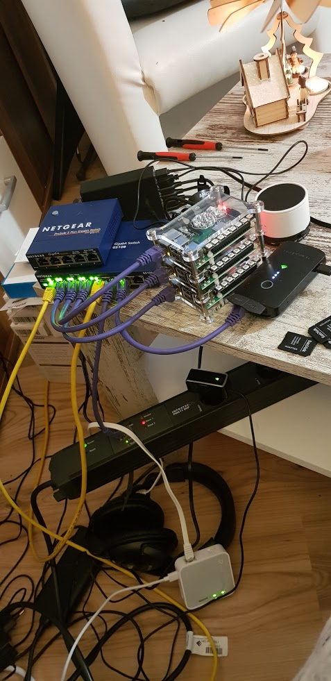

# Mittelerde-On-Embedded

Dies ist ein Repo für den Aufbau eines PI-Cluster mit Kubernetes für ein "Capture the Flag" Spiel. \
Wir bauen dabei auf folgendem Repo auf: https://github.com/bee42/kubernetes-on-embedded \
\
Danke an @rossbachp und @solidnerd für euren Spieltrieb.

## Installation

[Beschreibung zur Installation](https://github.com/bee42/kubernetes-on-embedded) 

Liebe Grüße \
Wolver <neo71.matrix@gmx.de>
